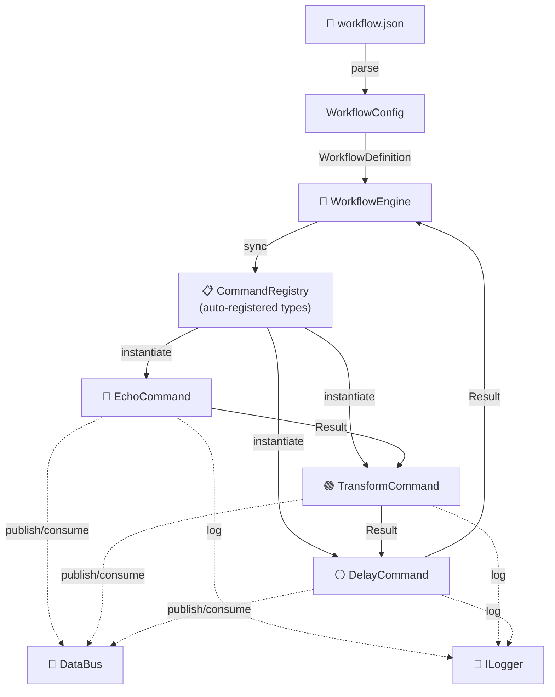

<p align="center">
  
  
  
  
</p>

<h1 align="center">⚙️ Workflow Engine</h1>
<p align="center"><strong>C++20 · Pipe & Filter · Command Pattern · Dependency Injection</strong></p>
<p align="center">A modular, decoupled, and production-ready task orchestration engine.</p>

---

## 📖 Overview

**Workflow Engine** is a C++20 framework for orchestrating multi-step data processing pipelines. Define your business logic as a sequence of independent, injectable **Commands** (filters), wire them together in a **JSON configuration file**, and let the engine execute them in order — with full observability, resilience, and zero coupling between steps.

### 🎯 Use Cases

| Domain | Example Pipeline |
|--------|-----------------|
| 🧑 User Onboarding | Validate → Enrich with GeoIP → Persist → Send email |
| 📊 ETL / Data Pipelines | Read CSV → Clean → Transform → Insert into DB |
| 💳 Payment Processing | Validate card → Fraud check → Charge → Generate receipt |
| 📝 Content Publishing | Validate text → AI moderation → Format → Publish to CMS |
| 🔧 CI/CD Steps | Clone → Build → Test → Deploy |

---

## 🏗️ Architecture



> Full architecture documentation with sequence diagrams, component contracts, and design rationale: **[docs/ARCHITECTURE.md](docs/ARCHITECTURE.md)**

### Design Patterns

| Pattern | Implementation |
|---------|---------------|
| **Pipe & Filter** | Data flows through an ordered chain of `ICommand` filters, each consuming the output of the previous one |
| **Command Pattern** | Every step encapsulates its logic in a common `ICommand` interface |
| **Dependency Injection** | `ILogger`, `DataBus`, and configuration are injected into constructors — nothing is global |
| **Result Monad** | `Result<T>` for explicit, exception-free error handling at every pipeline step |
| **Plugin Architecture** | Commands auto-register via static initialization; dynamic `.dll`/`.so` loading supported |

---

## 🚀 Quick Start

### Prerequisites

- **C++20** compiler (MSVC 2022+, GCC 11+, Clang 14+)
- **CMake 3.20+**
- [nlohmann/json](https://github.com/nlohmann/json) v3.11.3 (included in `external/`)

### Build & Run

```bash
# Configure
cmake -B build

# Build (Release with full optimizations)
cmake --build build --config Release

# Run the demo pipeline
.\build\Release\workflow_demo.exe    # Windows
./build/Release/workflow_demo        # Linux / macOS

# Run all 41 unit tests
.\build\Release\test_result.exe && .\build\Release\test_datapacket.exe && .\build\Release\test_engine.exe && .\build\Release\test_observability.exe
```

### Demo Output

```
========================================
  WORKFLOW ENGINE — DEMO DE EJECUCION
========================================

[2026-05-27 23:20:51.237] [INFO] Executing workflow: user-onboarding
[2026-05-27 23:20:51.237] [INFO] [1/4] Executing: echo-initial (EchoCommand)
[2026-05-27 23:20:51.239] [INFO] [echo-initial] Starting user onboarding pipeline
[2026-05-27 23:20:51.246] [INFO] [2/4] Executing: transform-user (TransformCommand)
[2026-05-27 23:20:51.247] [DEBUG] Transformed value: 'ID_JUAN_PEREZ'
[2026-05-27 23:20:51.253] [INFO] [3/4] Executing: simulate-api-call (DelayCommand)
[2026-05-27 23:20:51.253] [INFO] [simulate-api-call] Delaying for 100 ms
[2026-05-27 23:20:51.359] [INFO] [4/4] Executing: echo-complete (EchoCommand)
[2026-05-27 23:20:51.361] [INFO] Valor de 'output_key' encontrado: 'ID_JUAN_PEREZ'

Pipeline completado exitosamente.
Entradas en el DataPacket final: 2
```

---

## 🧩 Core Components

### `Result<T>` — Error Handling Without Exceptions

```cpp
// Success
auto ok = Result<DataPacket>::ok(my_packet);
ok.is_ok();        // true
auto data = ok.value();

// Failure
auto err = Result<DataPacket>::error("File not found", 404);
err.is_error();    // true
err.error_message(); // "File not found"
err.error_code();    // 404

// Safe default
auto val = result.value_or(fallback_packet);
```

### `DataPacket` — Type-Safe Generic Container

```cpp
DataPacket packet;
packet.set("user_id", 42);
packet.set("name", std::string("Alice"));
packet.set("score", 95.5);

// Type-safe retrieval via Result<T>
auto id   = packet.get<int>("user_id");          // Result<int>
auto name = packet.get<std::string>("name");     // Result<std::string>

// JSON roundtrip
auto json = packet.to_json();
auto restored = DataPacket::from_json(json);
```

### `ICommand` — Filter Interface

```cpp
class MyFilter : public ICommand {
    std::string name() const override { return "MyFilter"; }

    Result<DataPacket> execute(
        const DataPacket& input,
        DataBus& bus,
        ILogger& logger
    ) override {
        logger.info("Processing...");
        auto output = input;
        output.set("processed", true);
        return Result<DataPacket>::ok(std::move(output));
    }
};
```

### `DataBus` — Inter-Command Communication

Commands **never reference each other**. They communicate through the shared `DataBus`:

```cpp
// Command A
bus.set_shared("user_id", 42);
bus.set_shared("geo_ip", std::string("US"));

// Command B (later in pipeline — no coupling to A)
auto id  = bus.get_shared<int>("user_id");        // Result<int>::ok(42)
auto geo = bus.get_shared<std::string>("geo_ip"); // Result<string>::ok("US")
```

### `ILogger` — Pluggable Logging

```cpp
// Production
auto logger = std::make_unique<ConsoleLogger>();

// Testing
MockLogger mock;
mock.info("hello");
auto entries = mock.entries();  // std::vector<{LogLevel, message}>
```

---

## ⚙️ Configuration (JSON)

```json
{
    "name": "user-onboarding",
    "description": "Process new user registration",
    "on_error": "halt",
    "audit": true,
    "pipeline": [
        {
            "type": "EchoCommand",
            "name": "echo-initial",
            "params": { "message": "Starting pipeline" }
        },
        {
            "type": "TransformCommand",
            "name": "transform-user",
            "params": {
                "input_key": "user",
                "output_key": "transformed_id",
                "transform": "uppercase",
                "prefix": "ID_"
            }
        },
        {
            "type": "DelayCommand",
            "name": "simulate-api-call",
            "params": { "duration_ms": 100 }
        },
        {
            "type": "EchoCommand",
            "name": "echo-complete",
            "params": { "message": "Pipeline complete — checking result" }
        }
    ]
}
```

### Configuration Reference

| Field | Type | Required | Description |
|-------|------|----------|-------------|
| `name` | string | ✅ | Unique workflow identifier |
| `description` | string | ✅ | Human-readable description |
| `on_error` | `"halt"` \| `"continue"` | ❌ | `halt` (default) stops pipeline on error; `continue` keeps going |
| `audit` | boolean | ❌ | `true` saves pre/post snapshots of every step to `logs/audit/` |
| `pipeline` | array | ✅ | Ordered list of command steps |
| `pipeline[].type` | string | ✅ | Registered command type name |
| `pipeline[].name` | string | ✅ | Instance name (for logging and tracing) |
| `pipeline[].params` | object | ❌ | Type-specific configuration for the command |

---

## 🛡️ Resilience & Observability

### Error Policies

```json
{ "on_error": "halt" }
```
Pipeline stops immediately. Error message and code propagate to the caller.

```json
{ "on_error": "continue" }
```
Error is logged, current `DataPacket` is preserved, and execution advances to the next step.

### Exception Safety

Every command execution is wrapped in `try-catch`. The engine catches:
- `std::exception` — logged with `.what()`
- Unknown exceptions — logged as `"Unknown exception"`
- Factory instantiation failures — caught before pipeline starts

### Audit Snapshots

When `"audit": true`, the engine writes atomic JSON snapshots to `logs/audit/`:

```
logs/audit/
├── user-onboarding_step1_echo-initial_pre.json      ← Before execution
├── user-onboarding_step1_echo-initial_success.json   ← After success
├── user-onboarding_step2_transform-user_pre.json
├── user-onboarding_step2_transform-user_success.json
├── ...
└── (post-mortem snapshots on failure/exception)
```

Each snapshot contains: `DataPacket` state, `DataBus` state, timestamp, and step metadata.

---

## 📂 Project Structure

```
workflow-engine/
├── include/                         # Public headers (interfaces)
│   ├── ICommand.hpp                # Base command interface
│   ├── DataPacket.hpp              # Generic typed key-value container
│   ├── Result.hpp                  # Result<T> error-handling monad
│   ├── ILogger.hpp                 # Logging abstraction (TRACE→ERROR)
│   ├── DataBus.hpp                 # Inter-command shared state bus
│   ├── WorkflowConfig.hpp          # JSON config → WorkflowDefinition parser
│   ├── WorkflowSchema.hpp          # Config schema validation
│   ├── WorkflowEngine.hpp          # Pipeline orchestrator + factory registry
│   ├── CommandRegistry.hpp         # Global auto-registration registry
│   ├── ConsoleLogger.hpp           # Console-backed ILogger (with timestamps)
│   └── IPlugin.hpp                 # Dynamic plugin interface
│
├── src/                             # Core implementations
│   ├── WorkflowEngine.cpp          # Pipeline execution, audit, resilience
│   ├── WorkflowConfig.cpp          # JSON loading + parsing
│   ├── WorkflowSchema.cpp          # Schema validation logic
│   ├── DataPacket.cpp              # Type-safe container operations
│   ├── DataBus.cpp                 # Shared state + JSON serialization
│   ├── ConsoleLogger.cpp           # Timestamped console logging
│   ├── PluginLoader.cpp            # Dynamic .dll/.so loading
│   └── main.cpp                    # Demo executable
│
├── plugins/                         # Command implementations (filters)
│   ├── EchoCommand.hpp / .cpp      # Logs messages + reads/writes DataPacket
│   ├── DelayCommand.hpp / .cpp     # Configurable delay (simulates I/O)
│   └── TransformCommand.hpp / .cpp # Key transformation with prefix/suffix
│
├── tests/                           # Unit tests (41 tests, 0 failures)
│   ├── mocks/
│   │   ├── MockLogger.hpp          # Captures log entries for assertions
│   │   └── MockCommand.hpp         # Configurable result + execution spy
│   ├── test_result.cpp             # 9 tests — Result<T> monad
│   ├── test_datapacket.cpp         # 13 tests — DataPacket + JSON roundtrip
│   ├── test_workflow_engine.cpp    # 7 tests — Pipeline execution + DataBus
│   └── test_observability.cpp      # 12 tests — Audit, resilience, post-mortem
│
├── config/
│   └── workflow.json               # Example 4-step user onboarding pipeline
│
├── external/
│   └── nlohmann/
│       └── json.hpp                # nlohmann/json v3.11.3 (single header)
│
├── docs/
│   └── ARCHITECTURE.md             # Full architecture with Mermaid diagrams
│
├── CMakeLists.txt                  # Build configuration
└── README.md                       # This file
```

---

## 🧪 Testing

```bash
# Build and run all test suites
cmake --build build --config Release
.\build\Release\test_result.exe
.\build\Release\test_datapacket.exe
.\build\Release\test_engine.exe
.\build\Release\test_observability.exe
```

### Test Coverage

| Test File | Tests | Coverage |
|-----------|-------|----------|
| `test_result.cpp` | 9 | `Result<T>` creation, `.value()`, `value_or()`, error propagation, copy/move semantics, `Result<void>` |
| `test_datapacket.cpp` | 13 | `set`/`get` for int, double, string, const char*; missing keys, wrong types, overwrite, JSON roundtrip, copy/move |
| `test_workflow_engine.cpp` | 7 | Empty pipeline, single/multi-step execution, error halting, DataBus inter-command state, unknown type errors |
| `test_observability.cpp` | 12 | DataBus JSON serialization, `audit`/`on_error` parsing, exception HALT vs CONTINUE, audit snapshots, post-mortem, null-bus auto-create |
| **Total** | **41** | 

---

## 🔌 Adding a New Command

1. **Create the plugin files:**
   ```bash
   touch plugins/MyCommand.hpp plugins/MyCommand.cpp
   ```

2. **Implement `ICommand`:**
   ```cpp
   // plugins/MyCommand.hpp
   #pragma once
   #include "ICommand.hpp"
   #include "CommandRegistry.hpp"

   class MyCommand : public workflow::ICommand {
   public:
       explicit MyCommand(const nlohmann::json& params);

       std::string name() const override { return "MyCommand"; }

       workflow::Result<workflow::DataPacket> execute(
           const workflow::DataPacket& input,
           workflow::DataBus& bus,
           workflow::ILogger& logger
       ) override;

   private:
       nlohmann::json params_;
   };

   // Auto-register — no manual registration needed
   REGISTER_COMMAND(MyCommand)
   ```

3. **Include the header in `main.cpp`:**
   ```cpp
   #include "MyCommand.hpp"
   ```

4. **Add to your JSON pipeline:**
   ```json
   { "type": "MyCommand", "name": "my-step", "params": { "key": "value" } }
   ```

5. **Rebuild and run:**
   ```bash
   cmake --build build --config Release
   ```

---

## 🎨 Design Decisions

| Decision | Rationale |
|----------|-----------|
| `Result<T>` over exceptions | Explicit error checking at every step. No hidden control flow. Engine can decide halt, retry, or skip. |
| `std::unique_ptr` everywhere | Compile-time ownership enforcement. No `shared_ptr` overhead. Clear lifetime semantics. |
| `DataBus` as shared context | Commands never reference each other by name. Zero coupling. Publish/consume pattern. |
| `ILogger` injection | Fully testable — `MockLogger` captures log calls. Production impl can write anywhere. |
| JSON-driven configuration | Pipelines are data, not code. Reorder/rewire without recompilation. |
| Auto-registration (REGISTER_COMMAND) | Zero boilerplate. Include the header, sync the registry, done. |
| Audit snapshots as atomic JSON | No binary formats. Human-readable forensics. Compressible and searchable. |

---

## 📄 Documentation

- **[ARCHITECTURE.md](docs/ARCHITECTURE.md)** — Full architecture with Mermaid class/sequence/component diagrams, data flow sequences, error handling strategy, testability design, and technology stack.

---

## 📜 License

This project is licensed under the [MIT License](LICENSE) — free for personal and commercial use.

---

<p align="center">
  <sub>Built with ❤️ using C++20 · CMake · nlohmann/json</sub>
</p>
