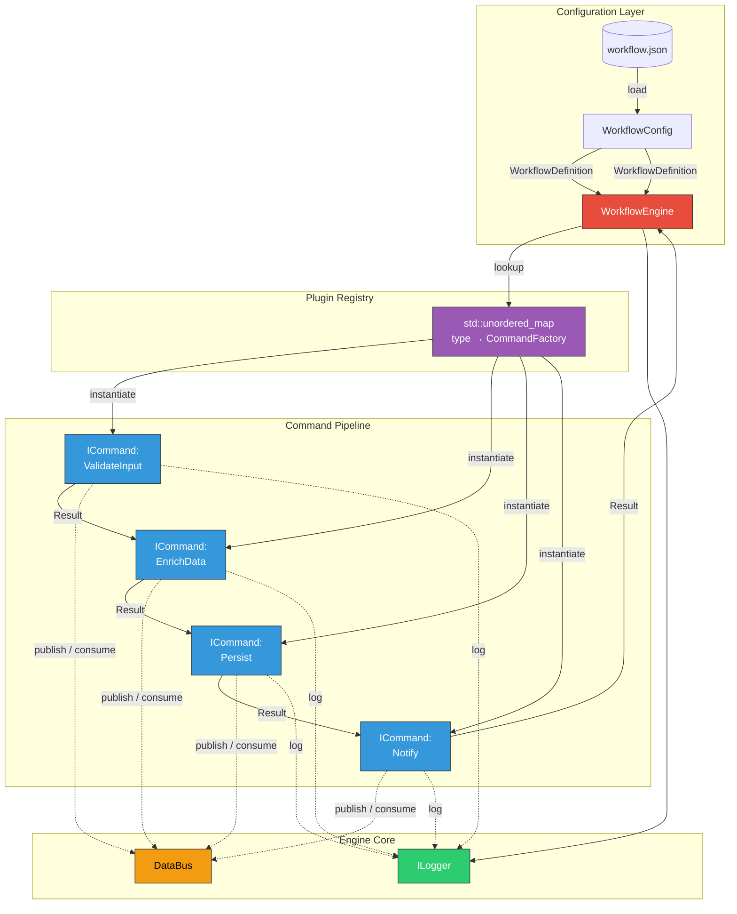
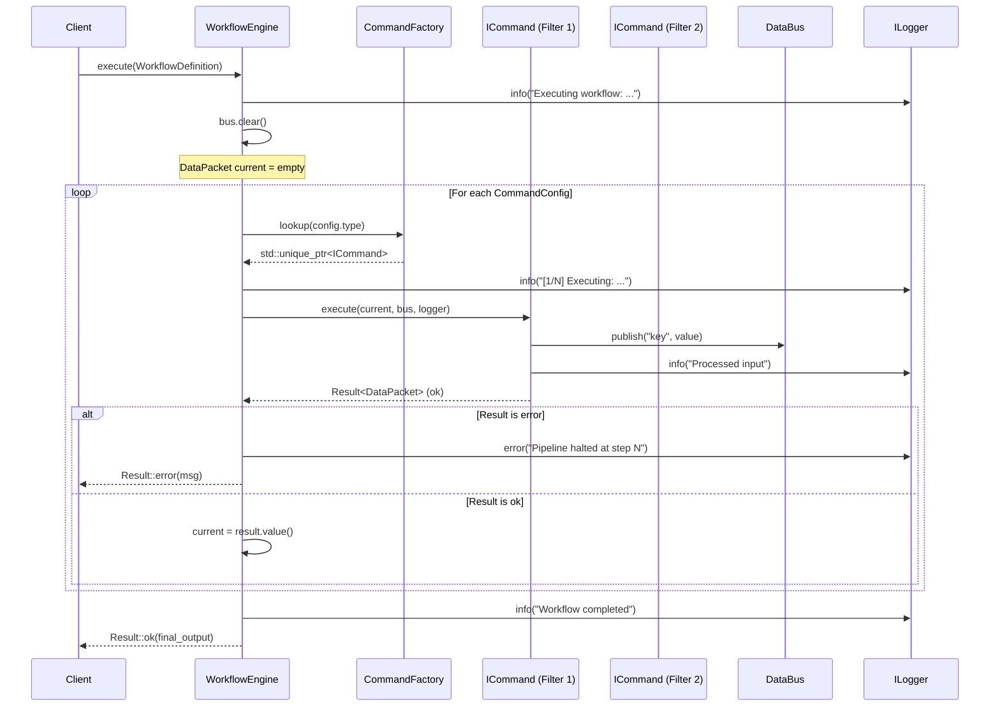

# 🏗️ Workflow Engine — Architecture Document

## Table of Contents
1. [Overview](#overview)
2. [Architectural Patterns](#architectural-patterns)
3. [Component Diagram](#component-diagram)
4. [Data Flow](#data-flow)
5. [Key Abstractions](#key-abstractions)
6. [Pipeline Execution Sequence](#pipeline-execution-sequence)
7. [Error Handling Strategy](#error-handling-strategy)
8. [Testability Design](#testability-design)

---

## Overview

**Workflow Engine** is a C++20 micro-framework for orchestrating data-processing pipelines. It follows the **Pipe & Filter** architectural style combined with the **Command Pattern**, enabling modular, testable, and JSON-configurable workflows.

### Design Goals
| Goal | Approach |
|------|----------|
| **Modularity** | Each filter is a standalone `ICommand` — zero coupling between commands |
| **Configurability** | Pipelines are defined in JSON; no recompilation needed to reorder steps |
| **Testability** | All dependencies injected; every component has a mock counterpart |
| **Error Resilience** | `Result<T>` monad ensures explicit error handling at every step |
| **Memory Safety** | `std::unique_ptr` for single-owner semantics; no raw pointer ownership |

---

## Architectural Patterns

### Pipe & Filter (Primary)
Data flows through an ordered sequence of independent filters (commands). Each filter receives input, processes it, and produces output consumed by the next filter. The `WorkflowEngine` is the **Pipe** connecting **Filters** together.

### Command Pattern
Each filter implements the `ICommand` interface:
```cpp
class ICommand {
    virtual Result<DataPacket> execute(const DataPacket& input,
                                        DataBus& bus,
                                        ILogger& logger) = 0;
};
```
Commands encapsulate their logic in the `execute()` method. The engine treats all commands uniformly — it doesn't care about internal implementation.

### Dependency Injection
All external concerns (logging, shared state, configuration) are injected via constructors:
- **ILogger** → injected into each command's `execute()` call
- **DataBus** → injected as a shared context across all commands
- **WorkflowEngine** → receives logger + bus at construction

No global state. No service locator. No `std::cout` in production code.

---

## Component Diagram



---

## Data Flow



**Key points:**
1. Each command receives the **output** of the previous command as its **input**.
2. Commands **never reference each other** — they communicate via `DataBus`.
3. If any `execute()` returns an error, the pipeline **halts immediately** and the error propagates to the caller.
4. `DataBus` is shared across all commands in a single execution and is **cleared** before each new execution.

---

## Key Abstractions

### Result<T> — Type-safe error handling
```cpp
// Success
Result<DataPacket> r = Result<DataPacket>::ok(packet);
r.is_ok();      // true
r.value();      // DataPacket

// Failure
Result<DataPacket> r = Result<DataPacket>::error("file not found", 404);
r.is_error();          // true
r.error_message();     // "file not found"
r.error_code();        // 404
```
No exceptions needed. Explicit error checking at every pipeline boundary.

### DataPacket — Generic data container
```
┌──────────────────────────────────────┐
│  DataPacket                          │
│  ┌────────────────────────────────┐  │
│  │ unordered_map<string, any>     │  │
│  │  "user_id"  → 42 (int)        │  │
│  │  "email"    → "a@b.com"       │  │
│  │  "metadata" → json object     │  │
│  └────────────────────────────────┘  │
│                                      │
│  .get<int>("user_id")    → Result<int>│
│  .set("score", 95.5)                 │
│  .to_json()              → nlohmann::json │
└──────────────────────────────────────┘
```

### DataBus — Inter-command communication
```
Command A                      Command B
  │                               │
  │  bus.set_shared("x", 10)      │  bus.get_shared<int>("x")
  │         │                     │    │
  │         ▼                     │    ▼
  │    ┌──────────────────────┐   │  Result<int>::ok(10)
  │    │    DataBus           │   │
  │    │  shared_state_       │   │
  │    │  "x" → 10            │   │
  │    └──────────────────────┘   │
  │                               │
```

### ILogger — Logging abstraction
```
┌─────────────────────────────────────────┐
│           <<interface>>                  │
│             ILogger                      │
│  ┌───────────────────────────────────┐  │
│  │ + log(level, message)             │  │
│  │ + info(msg)                       │  │
│  │ + warn(msg)                       │  │
│  │ + error(msg)                      │  │
│  │ + debug(msg)                      │  │
│  └───────────────────────────────────┘  │
└─────────────────────────────────────────┘
           △               △
           │               │
  ┌────────┴────┐  ┌──────┴─────────┐
  │ConsoleLogger │  │  MockLogger     │
  │→ std::cout   │  │  → std::vector  │
  └──────────────┘  └────────────────┘
```

---

## Pipeline Execution Sequence

```
JSON Config Load
     │
     ▼
┌─────────────────────────────────────────────────┐
│  WorkflowEngine::execute(WorkflowDefinition)     │
│                                                   │
│  1. Reset DataBus                                │
│  2. Create empty DataPacket as initial input      │
│  3. For each CommandConfig in pipeline:           │
│     a. Look up factory in registry_               │
│     b. Call factory(params) → ICommand            │
│     c. Check optional depends_on keys on DataBus  │
│     d. Call command->execute(input, bus, logger)  │
│     e. IF RESULT IS ERROR → halt, return error    │
│     f. input = result.value() (next filter)       │
│  4. Return final DataPacket                      │
└─────────────────────────────────────────────────┘
```

---

## Error Handling Strategy

| Scenario | Behavior |
|----------|----------|
| JSON file not found | `WorkflowConfig::load_from_file` returns error; engine returns it |
| Unknown command type | Engine logs and returns error; pipeline never starts |
| Command factory exception | Engine catches `std::exception`, logs, returns error |
| Command returns error | Pipeline halts; error message + code propagated |
| Missing DataBus dependency | Non-fatal warning logged; command handles it via `Result<T>` |

**No exceptions are thrown across component boundaries.** All failures are communicated via `Result<T>`.

---

## Testability Design

### What's mockable?
| Component | Production | Test Mock |
|-----------|-----------|-----------|
| ILogger | ConsoleLogger | MockLogger (collects log entries) |
| ICommand | EchoCommand, etc. | MockCommand (configurable result) |
| DataBus | DataBus | Same class (stateless, testable as-is) |
| DataPacket | DataPacket | Same class (value object) |
| WorkflowConfig | Loads from file | Accepts in-memory `nlohmann::json` |

### MockLogger capabilities
```cpp
MockLogger logger;
logger.info("hello");
auto entries = logger.entries();  // vector<pair<LogLevel, string>>
EXPECT_EQ(entries[0].level, LogLevel::INFO);
```

### MockCommand capabilities
```cpp
MockCommand cmd;
cmd.set_error_result("simulated failure", 500);
cmd.set_execute_callback([&](auto& input, auto& bus, auto& logger) {
    bus.set_shared("was_called", true);
});
auto result = cmd.execute(input, bus, logger);
EXPECT_TRUE(result.is_error());
EXPECT_EQ(result.error_code(), 500);
```

### Test example
```cpp
// test_engine_pipeline_data_flow.cpp
WorkflowEngine engine(mock_logger, mock_bus);
engine.register_command_factory("Append", [](auto params) {
    return std::make_unique<AppendCommand>(params);
});
// ... define pipeline ...
auto result = engine.execute(config);
EXPECT_TRUE(result.is_ok());
EXPECT_EQ(result.value().get<int>("a").value(), 1);
```

---

## Directory Structure

```
workflow-engine/
├── include/            # Public headers (interfaces)
│   ├── ICommand.hpp
│   ├── DataPacket.hpp
│   ├── Result.hpp
│   ├── ILogger.hpp
│   ├── DataBus.hpp
│   ├── WorkflowConfig.hpp
│   └── WorkflowEngine.hpp
├── src/                # Core implementations
│   ├── DataPacket.cpp
│   ├── ConsoleLogger.cpp
│   ├── WorkflowConfig.cpp
│   ├── WorkflowEngine.cpp
│   └── main.cpp
├── plugins/            # Command implementations
│   ├── EchoCommand.hpp/.cpp
│   ├── DelayCommand.hpp/.cpp
│   └── TransformCommand.hpp/.cpp
├── tests/
│   ├── mocks/
│   │   ├── MockLogger.hpp
│   │   └── MockCommand.hpp
│   ├── test_result.cpp
│   ├── test_datapacket.cpp
│   └── test_workflow_engine.cpp
├── config/
│   └── workflow.json
├── external/
│   └── nlohmann/
│       └── json.hpp
├── docs/
│   └── ARCHITECTURE.md
├── CMakeLists.txt
└── README.md
```

---

## Technology Stack

| Component | Choice | Rationale |
|-----------|--------|-----------|
| Language | C++20 | `std::any`, designated initializers, concepts |
| JSON | nlohmann/json v3.11 | Single-header, STL-like API |
| Build | CMake 3.20+ | Cross-platform, IDE-agnostic |
| Testing | Custom framework | No external dependency needed for this skeleton |
| Memory | `std::unique_ptr` | Compile-time ownership enforcement |